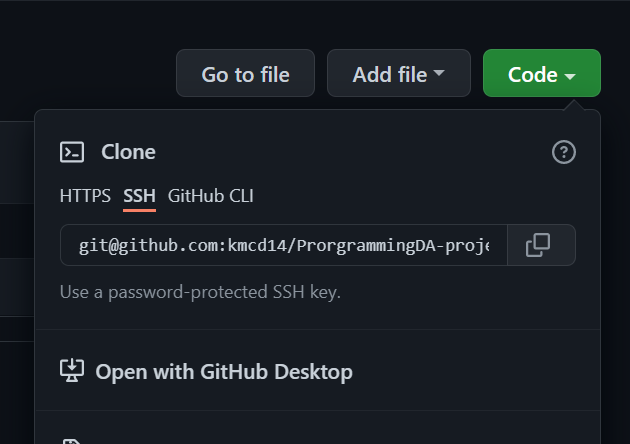

#  <b>PROGRAMMING FOR DATA ANALYSIS PROJECT</b>

<br>


<br></br>
This respository contains Jupyter notebooks and other relevant files relating to the module assessment for Programming For Data Analysis.
 This `README.md` file contains the documentation for technologies and libraries used for the project. 


All notebooks and all other relevant files can be found at: https://github.com/kmcd14/ProgrammingDA-project.

<br>

---

<br>
<h2><u>Table of Contents</u></h2></summary>
<br>
  <ol>
    <li><a href='#Description'> Description</a></li>
    <li><a href="#Script">How To Get The Respoistory on Your Machine</a></li>
    <li><a href="#Jupyter">Running Jupyter Notebook</a></li>
    <li><a href='#Technologies_Used'>Technologies Used</a></li>
    <li><a href="#Libraries_Used">Libraries Used</a></li>
    <li><a href="#credits">Credits</a></li>
    <li><a href="#contact">Contact</a></li>
    
  </ol>
<br>

---

---

<br>
<h2><b><u><p id='Description'> Description</b></u></p></h2>
<br>


 <h3><u> Data Simulation </u></h4>

<br>

The notebook `data_sim.ipynb` is in relation to the matplotlib.pyplot assessment for the module. 

The aim of this notebook is 

<br>

 <h4><u> Objectives: </u></h4>
 <ul>
  <li>Choose a real-world phenomenon that can be measured and for which you could
collect at least one-hundred data points across at least four different variables.</li>
  <li>Investigate the types of variables involved, their likely distributions, and their
  <li>Synthesise/simulate a data set as closely matching their properties as possible.</li>
relationships with each other.</li>
<li>Detail your research and implement the simulation in a Jupyter notebook – the
data set itself can simply be displayed in an output cell within the notebook.</li>
  <li>A clear and informative READMe file.</li>
 
</ul>

<br>


<br></br>


<br>


---

<br><br>

<h2><b><u><p id='Script'> How To Get The Respoistory on Your Machine</b></u></p></h2>
<br>
<ol>

<li>Using your browser navigate to the repository:  

https://github.com/kmcd14/ProgrammingDA-project.

<br> </il>




<br>
<li>Under clone, copy the repository address, as seen in the above picture, using either SSH or HTTPS</li>
<li> Open your teminal.</li>
<li> Naviagte to the location where you want to store the cloned directory.</li>
<li>In the terminal type the command:

<br>

    $git clone git@github.com:kmcd14/ProrgrammingDA-project.git


</li>
<li>Press enter. The cloned reposistory is now on your machine.
</li>
</ol>

<br></br>

---
<br></br>
<h2><b><u><p id='Jupyter'>Running Jupyter Notebook</p></b></u></p></h2>

<br>

The easiest way to run the notebooks is by python installed via the Anaconda distribution. 
Anaconda is the most widely used python distribution in data science fields as it comes preloaded with most of the most popular packages and tools. You can find out more about Anaconda and how to install it here
  https://docs.anaconda.com/.

<br>

You can forgo downloading Anconda and install each package indvidually in the python shell. A full list of requirements for each notebook can be found in the `requirements.txt` file in this repoistory. Full details and links to each package used can be found further down in this README. 

<br>
Additionally, if you wish to view the notebook without having to install additional requirements, please click on the following badges to be redirected in your browser. 

<br> </br>

`data_sim.ipynb`

[](https://nbviewer.org/github/kmcd14/ProgrammingDA-project/blob/main/data_sim.ipynb)

<br> </br>


<br>
<br>

### Opening and Running The Notebook

<br>

  
  - From the command line navigate to the folder you have cloned the repository to.
  - Type `jupyter lab`  or `jupyter notebook` into the command line and press enter to lauch the the jupyer interface.
<br></br>
  
  <br></br>

  - In the side panel you will see all files in the respository as seen in the above image. 
  - Click on `data_sim` to open the notebook.
  - To run the code in a cell hold down the `shift key` and press `enter` or click `Kernal` in the top toolbar and run all cells.
  - To change between edit and read mode at any time press the `ESC key`.
  - When you have finished, shut down the kernal via file > shut down in the browser, close the browser and press Press `Ctrl + C` on the command line to terminate the programme.

<br></br>
Note: 

If the jupyter interface doesn't auctomatically open in your browser try specifying the browser eg:

      jupyter lab —browser=chrome


Jupyter Notebook has a full troubleshooting guide which can be found:
 https://jupyter-notebook.readthedocs.io/en/stable/troubleshooting.html
<br></br>


---

<br></br>
<h2><b><u><p id='Technologies_Used'> Technologies Used:</b></u></p></h2>
<br>
<b><u>Google Docs:</u></b> an online word processor used to write my documentation before transfering into this README file. 

https://www.google.com/docs/about/
<br></br>
<b><u>Anaconda:</u></b> the easiest way to perfrom Python data science machine learning on Windows, Linux and Mac OS. This script was created using Version 4.9.2. https://www.anaconda.com/distribution/
<br></br>
<b><u>Python:</u></b> an interpreted, object-oriented, high-level programming language with dynamic semantics. This script was created using Version 3.8.5. 
https://www.python.org/
<br></br>
<b><u>GitHub:</u></b> is a code hosting platform for collaboration and version control. https://github.com/
<br></br>
<b><u>Jupyter Lab/Jupyter Notebook:</u></b> a web-based interactive development environment for Jupyter notebooks, code, and data. https://jupyter.org/
<br></br>
<b><u>NBViewer:</u></b> a web application which enables you enter the URL of a Jupyter Notebook file, renders that notebook as a static HTML web page, and gives you a stable link to that page which you can share with others. https://nbviewer.org/

<br></br>
<br></br>


---

<br></br>
<h2><b><u><p id='Libraries_Used'>Libraries Used:</b></u></p></h2>

Python has a vast and continuously growing library to choose from which makes it perfect for data analysis, such as Numpy and Pandas. It is a robust, flexible and efficient language which provides many solutions and avenues to approach and solve problems.

<br>

<b><u>A full list of each notebooks requirements can be found in the 
`requirements.txt` file in the project reposistory. </u></b>


<br>

<u><b>Numpy</b></u> is a Python library used for working with arrays. It produces a narray object. Numpy arrays are faster and more efficient than using python lists. It does this by storing arrays in one place in memory, so they can be accessed and manipulated quickly http://www.numpy.org/

<br>

<u><b>Mathplotlib</b></u> is a python library used to create plots, graphs, charts etc. https://matplotlib.org/

<br>

<u><b>Pandas</b></u> is a data manipulation tool built on Numpy. It’s key structure is the dataframe. You can think of a dataframe as a spreadsheet or table but, dataframes as are more efficient and powerful and are an integral part of Python and Numpy. Pandas will allow us to select specific rows and columns within the dataframe. https://pandas.pydata.org/

<br>

<u><b>Scikit-Learn</b></u> is a library in python that provides many unsupervised and supervised learning algorithms. It is one of the most popular and best known packages to do so. The package which provides users with efficient versions of a large number of common algorithms used in machine learning. It also features helpers to fetch larger datasets commonly used by the machine learning community to benchmark algorithms on data that comes from the ‘real world’. https://scikit-learn.org/

<br>

<u><b>Seaborn</b></u> is based on matplotlib and is also used to create data visualisations. “It provides a high-level interface for drawing attractive and informative statistical graphics.” https://seaborn.pydata.org/

<br>


<br>

<u><b>If your system does not have these libaries installed enter the below command from the command line: </b></u>

<br>

```
    $pip install <library name>
```

<br></br>

---

<br>

<h2><b><u><p id='credits'>Credits:</b></u></p></h2>


<br>

---

<br>

<h2><b><u><p id='contact'>Contact:</b></u></p></h2>

<a href="mailto:katieisanimdom@ygmail.com">katieisanimdom@gmail.com</a>  
